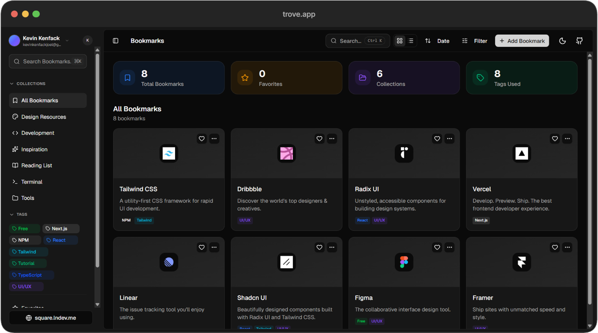

# 💎 Trove

**Trove** is a modern, minimalist bookmark manager designed for focused creators. It helps you organize your digital library with elegance, synchronize with ease, and find what you need in milliseconds.



## ✨ Features

- **Smart Collections**: Organize your links into projects or themes.
- **Deep Tagging**: A powerful tagging system for ultra-fast retrieval.
- **Command Palette**: Search everything instantly with `Ctrl + K`.
- **Magic Link Auth**: Secure and frictionless login experience via Supabase.
- **Premium UI**: Crafted with Tailwind CSS v4, featuring glassmorphism and subtle micro-animations.
- **Theme Sync**: Automatic synchronization with your system's light/dark mode.
- **Clean Workspace**: Smart archiving and trash management to keep your focus sharp.

## 🛠️ Tech Stack

- **Framework**: [Next.js 15 (App Router)](https://nextjs.org/)
- **Styling**: [Tailwind CSS v4](https://tailwindcss.com/)
- **Database & Auth**: [Supabase](https://supabase.com/)
- **State Management**: [Zustand](https://zustand-demo.pmnd.rs/)
- **Icons**: [Lucide React](https://lucide.dev/)
- **Components**: [Radix UI](https://www.radix-ui.com/) & [shadcn/ui](https://ui.shadcn.com/)
- **Package Manager**: [pnpm](https://pnpm.io/)

## 🚀 Getting Started

### 1. Clone the repository

```bash
git clone https://github.com/kevinkenfack/trove.git
cd trove
```

### 2. Install dependencies

Ensure you have [pnpm](https://pnpm.io/installation) installed.

```bash
pnpm install
```

### 3. Environment Setup

Create a `.env.local` file in the root directory and add your Supabase credentials:

```env
NEXT_PUBLIC_SUPABASE_URL=https://swuossvcjqexmdjsjzas.supabase.co
NEXT_PUBLIC_SUPABASE_PUBLUSHABLE_KEY=your-publishable-key
SUPABASE_SERVICE_ROLE_KEY=your-service-role-key
```

### 4. Database Setup

Once your environment variables are set, you need to synchronize your local database schema with Supabase:

1. **Login to Supabase CLI**:

   ```bash
   npx supabase login
   ```

2. **Link your project**:
   (Replace `<project-id>` with your actual Supabase project reference)

   ```bash
   npx supabase link --project-ref <project-id>
   ```

3. **Push the database schema**:
   This will run all migrations and set up your tables:
   ```bash
   npx supabase db push
   ```

### 5. Run the development server

```bash
pnpm dev
```

Open [http://localhost:3000](http://localhost:3000) with your browser to see the result.

## 📜 License

Distributed under the MIT License. See `LICENSE` for more information.

## 💖 Credits & Inspiration

This project was built with inspiration from the **Bookmarks** template found in [Square UI](https://github.com/ln-dev7/square-ui) by [LN DEV](https://github.com/ln-dev7). A huge thanks to the original creator for the wonderful UI/UX foundations.

---

Crafted with ❤️ by [Kevin Kenfack](https://github.com/kevinkenfack)
